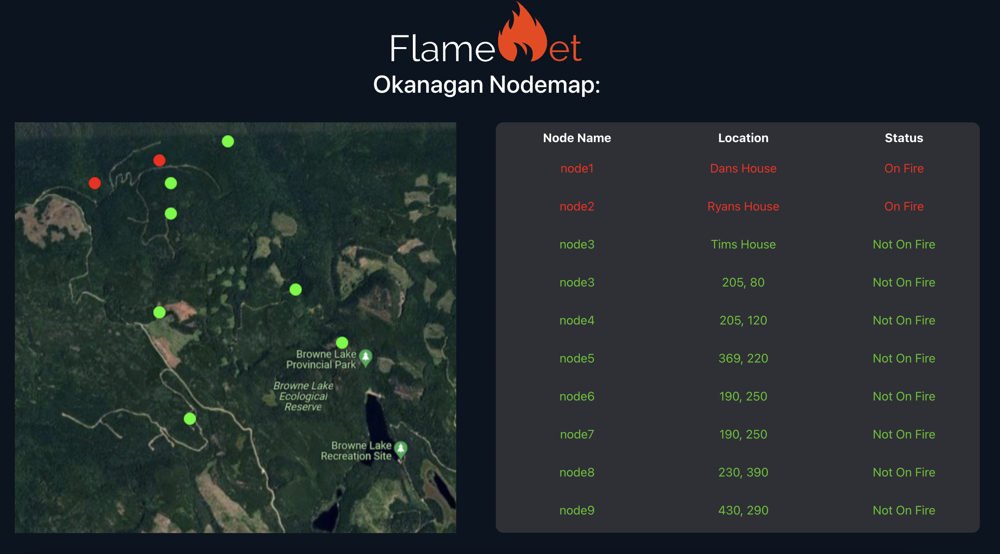
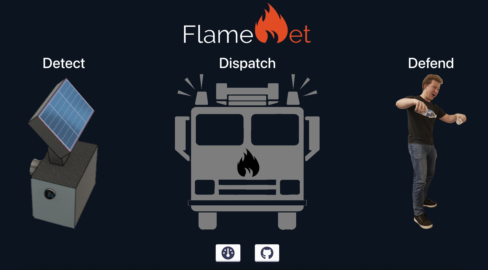

# FlameNet

<h4 align="center">A distributed network system capable of early wildfire detection in areas without developed infrastructure.</h4>
<h4 align="center">Project by: Tim Gubskiy, Daniel Sabourov, and Ryan Lee</h4>

<h4 align="center">Live Demo at [https://flamenet-b780e.web.app/dashboard]</h4>

<h4 align="center">FlameNet Dashboard</h4>

<h4 align="center">FlameNet Home Page</h4>

## Why Wildfires?

With greenhouse gas (GHG) emissions rising each year, our forests become increasingly vital to convert the carbon dioxide in our atmosphere into breathable oxygen. However, wildfires have caused our largest carbon sinks to become a source of GHG emissions instead. In 2021, the Amazon rainforest, the largest in the world, was no longer carbon neutral. We constantly hear about initiatives to plant trees, but what if planting trees is now worse for the environment? With this in mind, our team, FlameNet, developed a multifaceted approach to reduce the destruction caused by uncontrolled fires.

## How are we different?

Despite pre-existing methods to detect wildfires, over ten billion dollars of damage were caused by wildfires in the US between 2021-2022. Due to the inaccuracy of human evaluations, wildfires are not caught in the early stages and often grow uncontrollably. Currently, the Landsat-8 Multispectral Satellite is used to capture images to locate potential fires and fire hotspots. The data is sent to be evaluated by human “specialists”, who may miss the signals of a flame.

Conversely, our solution was a mix of hardware and software that greatly increases the automation of the detection of uncontrolled fires. This design can be generalized into a variety of other purposes, such as home safety or fire safety on large private properties. We have created a Nodal Mesh (our Net). When any node (called CFire Units) detects a flame, a signal is quickly broadcast between CFire units until it reaches the “main node.” This node is connected to the internet and uploads the location of the fire to our website, and sends a notification over text.

## What was our process?

Our team used an iterative idea generation process to ensure all ideas were explored. In order to make sure we explored every idea, our team discussed the development of a machine learning model, as well as a variety of sensors and automation. After researching certifications and regulations around fire safety devices, our team developed a large amount of “potential” designs by using morphological charts and used the Pugh method to choose a final conceptual design.

From our conceptual design, we developed our software and hardware prototypes. //Tim please sir

## Materials:

Hardware:

- [3x ESP32 Development Boards](https://www.amazon.com/Development-Microcontroller-Integrated-Antenna-Amplifiers/dp/B09GK74F7N/ref=sr_1_3?crid=2LQLVK5DUFJB0&keywords=esp32&qid=1668334356&sprefix=esp32%2Caps%2C107&sr=8-3)
- [3x Grove Temperature Sensors](https://www.digikey.com/en/products/detail/seeed-technology-co.,-ltd/101020015/5482612?utm_adgroup=Seeed%20Technology%20Co.%2C%20LTD.&utm_source=google&utm_medium=cpc&utm_campaign=Shopping_DK%2BSupplier_Tier%201%20-%20Block%202&utm_term=&utm_content=Seeed%20Technology%20Co.%2C%20LTD.&gclid=Cj0KCQiAyMKbBhD1ARIsANs7rEGy_DBF9nZJGFLarfIc-xHm5h-tDILt3xnjRtCqa0iZ1K66xrJRKNAaAr_TEALw_wcB)
- 3x Buttons
- Jumper Cables and a Breadboard

Software:

- [Firebase React App and Realtime Database](https://firebase.google.com/)
- [Twilio](https://www.twilio.com/)
- [Arduino IDE](https://docs.arduino.cc/software/ide-v2)

## Technical Information:

Our hack is composed of two interconnected sides, mending hardware and software together. We have built our CFire units, using ESP32 development boards, equipped with both Bluetooth and wifi, employing this functionality to make it closely integrated with our front end, built on React and Firebase.

### Hardware:
To create our mesh network of CFire units, we used ESP-NOW to communicate between multiple nodes, creating a resilient communication network that works in areas that don't have cellular service or WiFi. ESP-NOW can work at ranges up to 1600 feet allowing you to create a wide-reaching network at a low cost. In the future, we would also like to implement the network using LORA radio communication to allow the distance between CFire units to be up to 10 miles.

Our CFire nodes are set up such that you will need at least 1 ESP32 board designated as the master unit, connected to the internet using WiFi, and able to update our firebase real-time database. Every additional CFire unit is designated as a child unit and will use ESP-NOW, a Bluetooth communication protocol, to relay its data through the network to the master unit.

This method creates an extremely resilient distributed network, that is capable of spanning hundreds of kilometers without any prior infrastructure needed. This greatly lowers the cost of implementing early wildfire detection systems and can be affordably implemented in any scenario.

### Software:
To monitor our network of CFire units, we created a dashboard built using React and firebase. This website shows the up-to-date status of each unit currently deployed and integrates a map that allows us to see exactly where a wildfire started, and how it is spreading.

To quickly alert fire authorities about wildfires we used the Twilio API to send alert text messages and phone calls. 

## How to set it up:

To create our mesh network of CFire units, we used ESP-NOW to communicate between multiple nodes, creating a resilient communication network that works in areas that don't have cellular service or WiFi. ESP-NOW can work at ranges up to 1600 feet allowing you to create a wide reaching network at a low cost. In the future we would also like to implement the network using LORA radio communication to allow the distance between CFire units to be upto 10 miles.

To replicate our setup, you will need multiple ESP32 boards, and must designate one to be the master node, which will communicate with a WiFi network. All of the other nodes, will be the child CFire units, that dont need to connect to any WiFi network.

You can flash the master unit the "BlueToothMasterNodeCode.ino", making sure to change the WiFi SSID and password to that of your network, and updating the Twilio and Firebase API urls. Each child unit needs to be flashed with the "BlueToohChildNodeCode.ino" code, making sure to change nodeNum, to a unique value for your network, and adding the Mac Address, of all the connecting units in the network. If you don't know the Mac Address you can run the "FindMacAddress.ino" script on the ESP32 and read the address from the Serial Monitor.
